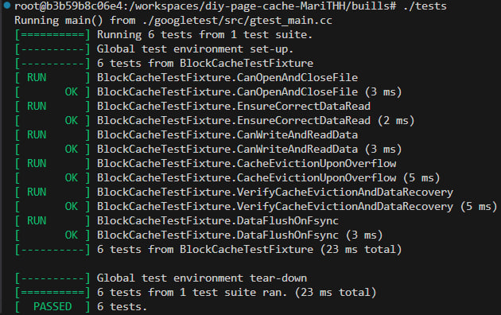

# Лабораторная работа №2

`Толстых Мария P3330`

`Вариант: Least Recently Used`

## Задание

В данной лабораторной работе необходимо реализовать блочный кэш в пространстве пользователя в виде динамической библиотеки. Политика вытеснения страниц - Least Recently Used.

При выполнении работы необходимо реализовать простой API для работы с файлами, предоставляющий пользователю следующие возможности:

Открытие файла по заданному пути файла, доступного для чтения.
Закрытие файла по хэндлу.
Чтение данных из файла.
Запись данных в файл.
Перестановка позиции указателя на данные файла.
Синхронизация данных из кэша с диском.

## Краткий обзор кода

Операции с файлами (open, close, read, write, lseek, fsync):

Используется алгоритм LRU (Least Recently Used) для замены блоков в кэше. Краткий обзор основных функций:

- open: Открывает файл с использованием флага O_DIRECT (для прямого доступа к данным), сохраняет файловый дескриптор в мапе.
- close: Закрывает файл, синхронизируя его данные перед закрытием.
- read: Читает данные из файла с использованием кэша. Если данные не найдены в кэше, они считываются с диска и сохраняются в кэш.
- write: Записывает данные в файл, сначала проверяя кэш. Если блок данных отсутствует, он загружается из файла в кэш.
- lseek: Перемещает указатель файла на заданную позицию.
- sync: Синхронизирует измененные данные кэша с файлом.
- evict_lru_page: Удаляет наименее используемую страницу из кэша и записывает её обратно в файл, если она была изменена.
Класс эффективно управляет кэшированием и синхронизацией данных, используя кеширование блоков с ограничением по размеру.

## Данные о работе программы-нагрузчика до и после внедрения своего page cache

Было при old_search_name

```zsh
real 0.30
user 0.13
sys 0.07
```

Стало при search_name

```zsh

real 0.16
user 0.05
sys 0.05
```

```zsh
root@b3b59b8c06e4:/workspaces/diy-page-cache-MariTHH/build# perf stat ./main search file1.txt 2
File found: "/workspaces/diy-page-cache-MariTHH/test_dir/file1.txt"
Read from file: Hello!
File found: "/workspaces/diy-page-cache-MariTHH/test_dir/file1.txt"
Read from file: Hello!
Total execution time: 7.12659 seconds

 Performance counter stats for './main search file1.txt 1':

            940.19 msec task-clock:u                     #    0.131 CPUs utilized             
                 0      context-switches:u               #    0.000 /sec                      
                 0      cpu-migrations:u                 #    0.000 /sec                      
               300      page-faults:u                    #  319.085 /sec                      
         715577614      cycles:u                         #    0.761 GHz                       
        1187863967      instructions:u                   #    1.66  insn per cycle            
         280535531      branches:u                       #  298.382 M/sec                     
           2678280      branch-misses:u                  #    0.95% of all branches           
                        TopdownL1                 #      0.2 %  tma_backend_bound      
                                                  #     99.8 %  tma_bad_speculation    
                                                  #     -0.0 %  tma_frontend_bound     
                                                  #      0.0 %  tma_retiring           

       7.153297419 seconds time elapsed

       0.195108000 seconds user
       1.058090000 seconds sys


root@b3b59b8c06e4:/workspaces/diy-page-cache-MariTHH/build# perf stat ./main old_search file1.txt 2
File found: "/workspaces/diy-page-cache-MariTHH/test_dir/file1.txt"
Read from file: Hello!

 Performance counter stats for './main old_search file1.txt 2':

           1071.97 msec task-clock:u                     #    0.125 CPUs utilized             
                 0      context-switches:u               #    0.000 /sec                      
                 0      cpu-migrations:u                 #    0.000 /sec                      
               298      page-faults:u                    #  277.992 /sec                      
         768893180      cycles:u                         #    0.717 GHz                       
        1187244068      instructions:u                   #    1.54  insn per cycle            
         280411039      branches:u                       #  261.584 M/sec                     
           3800112      branch-misses:u                  #    1.36% of all branches           
                        TopdownL1                 #      0.7 %  tma_backend_bound      
                                                  #     97.7 %  tma_bad_speculation    
                                                  #      0.6 %  tma_frontend_bound     
                                                  #      1.0 %  tma_retiring           

       8.546425330 seconds time elapsed

       0.221038000 seconds user
       1.175924000 seconds sys  сравни и сделай заключение почему первый поиск лучше
```

## Тесты



## Заключение

- Первый поиск (с кэшированием): 7.13 секунд.
- Второй поиск (без кэширования): 8.55 секунд.
Время выполнения первого поиска значительно ниже, что указывает на то, что кэширование данных с использованием LRU уменьшает количество операций с диском и ускоряет доступ к данным. Это также подтверждается снижением общего времени выполнения на более чем 1.4 секунды.

Использование процессора:

- Первый поиск: 0.195 секунд в user time, 1.06 секунд в sys time.
- Второй поиск: 0.22 секунд в user time, 1.18 секунд в sys time.
Время, проведенное в user space, почти одинаково, но sys time во втором случае выше. Это может указывать на больший объем операций ввода-вывода 

Циклы и инструкции:

- Первый поиск: 715 млн циклов, 1.66 инструкций на цикл.
- Второй поиск: 768 млн циклов, 1.54 инструкции на цикл.
В первом случае программа выполняет больше инструкций за меньшее количество циклов, что свидетельствует о более эффективном использовании процессора благодаря кэшированию.

- Заключение:
Первый поиск (с кэшированием) выполняется быстрее, поскольку кэш позволяет уменьшить количество операций ввода-вывода, минимизировать обращения к диску и более эффективно использовать процессор. Это подтверждается уменьшением времени выполнения, более низким временем в sys space и улучшением общей производительности, несмотря на почти одинаковое количество page-faults.

Кэширование эффективно снижает затраты на работу с дисковыми блоками и ускоряет выполнение программы, делая её более производительной по сравнению с вариантом без кэширования.